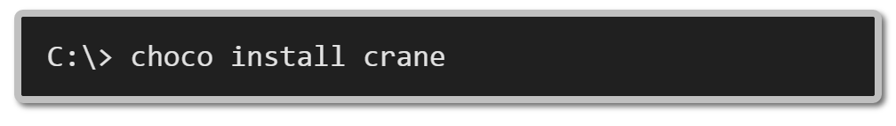
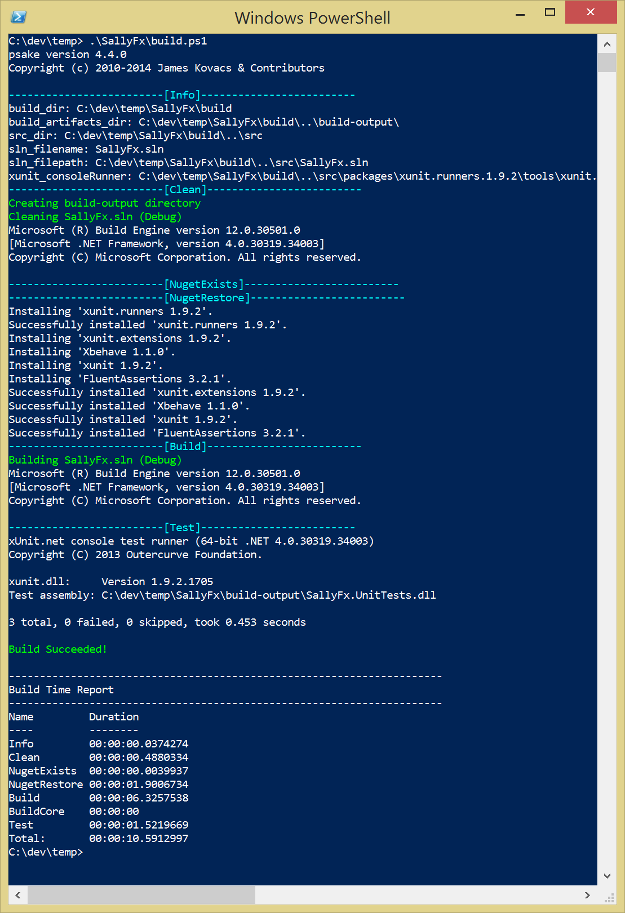

crane [](https://ci.appveyor.com/project/ewilde/crane/branch/master) [](http://teamcity.cranebuild.com/viewType.html?buildTypeId=crane_Master) [](https://chocolatey.org/packages/crane) [](https://chocolatey.org/packages/crane) [](https://waffle.io/ewilde/crane) [](https://waffle.io/ewilde/crane)
=====
[](https://gitter.im/ewilde/crane?utm_source=badge&utm_medium=badge&utm_campaign=pr-badge&utm_content=badge)

> Builds you into the pit of success

We hate writing build scripts and continuous integration (ci) templates every time
we start a new project. I'm sure you do as well. This is where `crane`comes in.
Invoke `crane` and it will build you a blank project with a build script
and ci template ready to rock.

#Installation
To install crane, run the following command from the command line or from PowerShell:
`choco install crane`


Don't have chocolatey installed? https://chocolatey.org/

#Please show me?
`crane init SallyFx`

This creates a new project called SallyFx in the current directory.

```
> crane init SallyFx


C:\DEV\TEMP\SALLYFX
|   build.ps1
|
+---build
|       default.ps1
|       NuGet.exe
|       psake-ext.psm1
|       psake.ps1
|       psake.psm1
|
\---src
    |   SallyFx.sln
    |
    +---.nuget
    |       packages.config
    |
    +---SallyFx
    |   |   Calculator.cs
    |   |   SallyFx.csproj
    |   |
    |   \---Properties
    |           AssemblyInfo.cs
    |
    \---SallyFx.UnitTests
        |   CalculatorFeature.cs
        |   packages.config
        |   SallyFx.UnitTests.csproj
        |
        \---Properties
                AssemblyInfo.cs
```

You can now build this project...




#Supported commands
##init
`init` initializes a new project.

**Example**:

`crane init SallyFx` create a new project called 'SallyFx'

The default crane project is quite opinionated we have made lots of decisions.
Here are the highlights:

**Build **

* psake powershell build system
* restores nuget packages
* patches your assembly info files with information from VERSION.txt and
last git commit message, if it's a git repo
* builds
* runs unit tests

**Project template**

* Solution file with
* Class library
* Unit test library
 * Using xbehave, EasyFakes,  bdd style tests

##help
`help {command}` lists required and optional parameters for commands

**Example**:

`crane help init` show help for the init command
